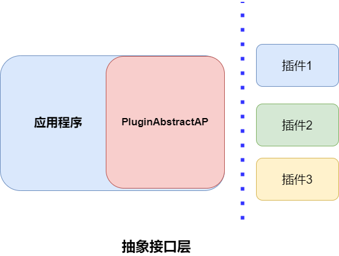
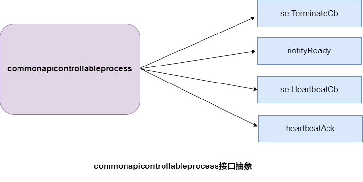

# PluginAbstractAPI 抽象接口层

### 高层模块与底层模块之间的抽象层，高层模块和底层模块都应该依赖此层



## commonapicontrollableprocess

提供以下服务:

1. **服务状态通知**：通知其它服务当前服务运行是否正常。
2. **服务终止操作**：在服务终止时执行必要的操作，如资源清理、通知等。
3. **健康监测功能**：通过心跳机制实现服务的健康监测。

### 编译代码
在使用的工程目录下执行以下命令进行编译：
### 代码编译：

```bash
make build
```
### 安装

```bash
make install
```

### 卸载
```bash
make uninstall
```
